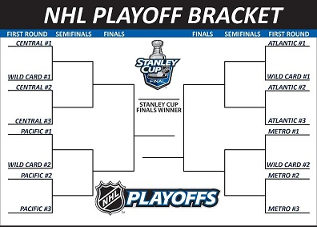
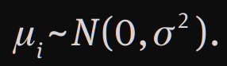
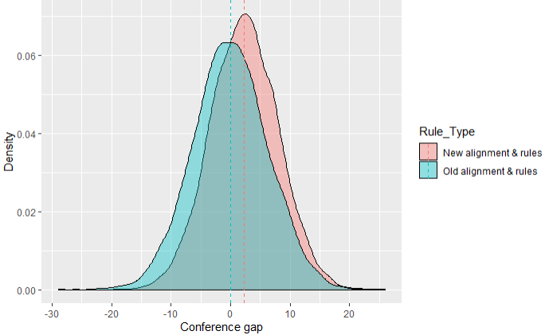

## The National Hockey League (NHL)

- Each team plays 82 games per season
- This allows for every team to play each team at least twice
- The league is split up into two conferences, the East and the West, each with two divisions
- The East has the Metropolitan and the Atlantic divisions while the West has the Central and Pacific divisions.

## The Changes for the 2013-14 season

- Winnipeg Jets move from the Eastern to the Western confrence
- Columbus Blue jackets and Detroit Redwings move from the West to the East
- Each conference previoulsy had three divisions of five teams but these were condensed into the four divisions that currently exist

# Point System
- Instead of basing ranking off of a team's win-loss record, the NHL tracks points for each team
- 2 points for win (regulation or overtime)
- 1 point for overtime loss
- 0 points for regulation loss

# Playoff Structure
- For the previous conference/division structure, the top two teams in each division secure a berth into the playoffs
- The remaining four slots are claimed by the two teams in each conference with the next highest point total regardles of the division. These are known as the wild cards.
- The process is similar with the new divisions in each conference
- Now the top three teams in each division secure a playoff berth and the wild cards are chosen using the same process as before

# The Reasoning for the Sampling

- Changes left the West with two divisions of 14 teams and the East with 2 divisions of 16 teams
- 8 teams from both conferences were garunteed to make the playoffs
- The sampling is meant to test whether or not it is more difficult to reach the playoffs as an eastern confrence team

# The Model: Goals

- To simulate the performance of each team over a season with varying rules
- To create an accurate scoring system that accounts for ties

# The Model: Goals

- To simulate the performance of each team over a season with varying rules
- To create an accurate scoring system that accounts for ties
- (For me) to learn how hockey works!

# The Model: Methods

- We generate each team's "quality" from a normal distribution
- For each of the games played we generate a "game performance" metric from a normal distribution with the mean being the respective team's quality.

# The Model: Methods

- A game will go into overtime ~ 22.4% of the time
- If the teams skills are within a threshold alpha, it will go into overtime
- Once in overtime rescale performances and determine winner by weighted coinflip

# The Model: Methods

- We simulate 10,000 seasons to gather our metrics
- Sort teams into the right conference, then into the right division based on which set of rules we are looking at (old or new)
- Calculate the conference gap

# 2013-2014 Season Results

- We have found a noticably large conference gap, with the mean of the old alignment being about -0.0202 and the mean of the new alignment being about 2.30.

# 2013-2014 Season Results

- Another interesting graph!

# What This Shows

- Based on this model we can predict that it is more likely that a team in the West will make the playoffs with a worse overall score than another team in the East much more often than a team in the East will make the playoffs with a worse overall score than another team in the West.

# Extension 2017-18 season

- This season added the Vegas Golden Knights
- Now the West has one divion of 8 teams and one division of 7 teams
- This creates new probabilities for the required points to make it to the playoffs

# Sources

- Pettigrew, Stephen. “How the West Will Be Won: Using Monte Carlo Simulations to Estimate the Effects of NHL Realignment.” Journal of Quantitative Analysis in Sports, vol. 10, no. 3, 1 Jan. 2014, 10.1515/jqas-2013-0125. Accessed 10 Dec. 2020.
